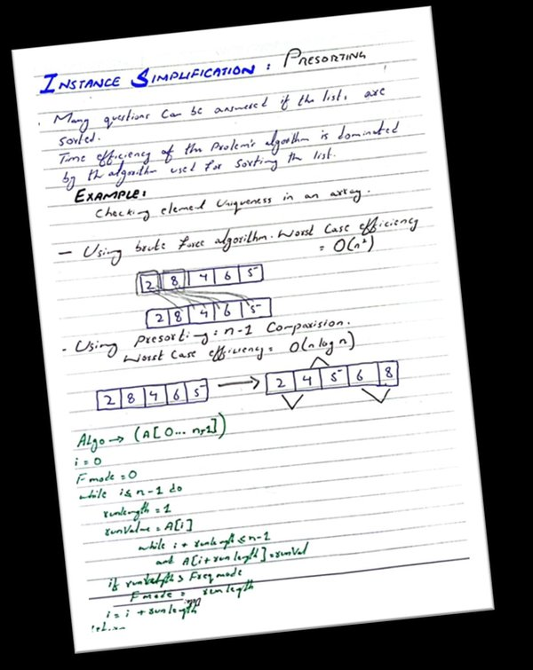
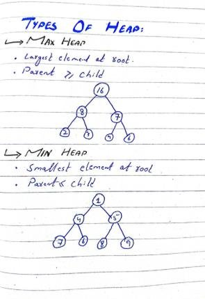
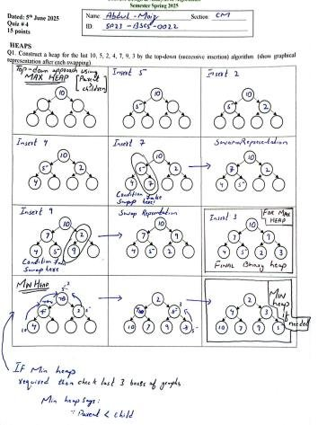
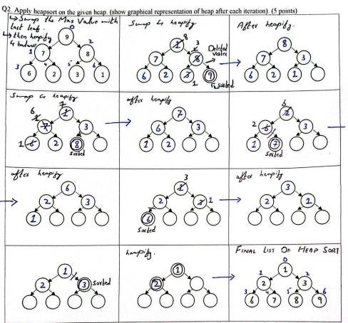
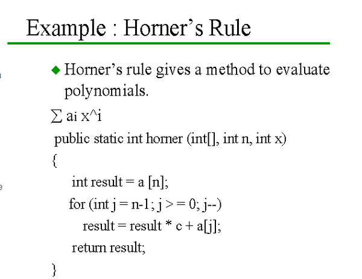
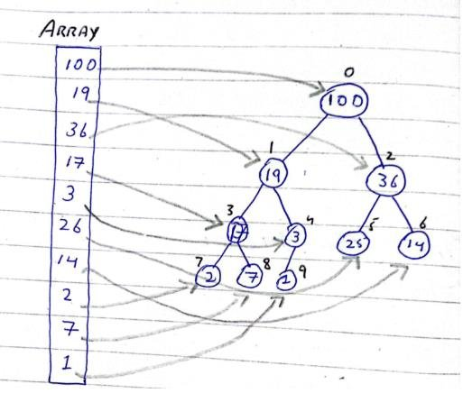
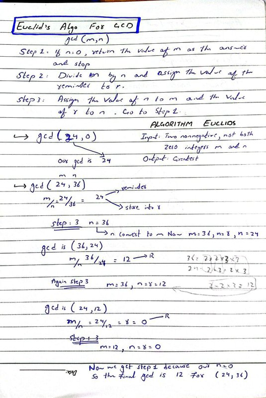

## 📄 Page 1

### **ABDUL MOIZ **
### **SP23-BSCS-0022 **
### **CM **

# **ASSIGNMENT # 3 **

### ** **

# *TRANSFORM AND CONQUER *

Transform and Conquer” is a method in algorithm design where we change a
problem into another form that is easier to solve.

**There are three ways to do this: **
- **Instance Simplification:** Change the problem into an easier version of the
same problem.
- **Representation Change:** Change the way the data is represented (without

changing the problem itself).
- **Problem Reduction: **Convert the problem into a different one for which a

solution already exists.** **
** **
**IN SIMPLE: **
**TRANSFORM AND CONQUER STRATEGY: **
** **

| Problem’s Instance | Simple instance
OR
Representation
OR
Problem Instance | SOLUTION |
| --- | --- | --- |

**Simple instance**
OR
**Representation**
OR
**Problem Instance**
** **
Problem’s Instance
SOLUTION
** **

## 📄 Page 2

# ***1. INSTANCE SIMPLIFICATION: ***

This means solving a problem more easily by simplifying the input first.
### **Example: Presorting: **
Sorting a list first can make many tasks easier:
Searching for an item
Finding the median (middle value)
Checking if all elements are unique
### **Element Uniqueness Example: **
Step 1: Sort the list (using Merge Sort or any efficient method)
Step 2: Go through the list and check if any two adjacent elements are the same
### **Time efficiency: **
Using presorting: Θ(n log n)
Without sorting (brute force): O(n²)
### **Computing Mode with Presorting: **
Sort the list first.
Then count how often each number appears.
This is faster than comparing every number with every other one.
### **Searching with Presorting: **
Sort the list first.
Then use binary search, which is much faster than linear search.

## 📄 Page 3

## 📄 Page 4

# **2. Representation Change **

Changing the way the data is stored can help solve problems more efficiently.
Example: Heap and Heapsort
A heap is a special kind of binary tree used to manage data efficiently.
**Types of Heaps: **

Max-Heap: Biggest value is at the top (root).
Min-Heap: Smallest value is at the top.

** **

## 📄 Page 5

### ** **

### **Heap Operations: **

Insert: Add an item, then adjust the heap → O(log n)
Delete-Max: Remove the top item (max), fix the heap → O(log n)
### **Heapsort Steps:**

Build a heap from the list.
Repeatedly remove the max item and adjust the heap.
Efficiency: Θ(n log n)
In-place sort (doesn’t need extra space)
Not stable (equal elements might change order)
**Horner’s Rule for Polynomial Evaluation **
**Problem: **
**Evaluate polynomial: **
**p(x) = aₙxⁿ + aₙ₋₁xⁿ⁻¹ + … + a₁x + a₀ **
**Brute-force Methods: **
**Use nested loops or repeated multiplications , Complexity: O(n²). **
**Priority Queue Implementation Using Heaps **
**Definition: **
**A Priority Queue is an Abstract Data Type (ADT) where each element has a priority. **
### **Comparison of Implementations: **

| Operation | Unsorted Array | Sorted List | Heap |
| --- | --- | --- | --- |
| Insert | O(1) | O(n) | O(log n) |
| FindMin | O(n) | O(1) | O(1) |
| RemoveMin | O(n) | O(1) | O(log n) |

Operation
Unsorted Array Sorted List Heap
Insert
O(1)
O(n)
O(log n)
FindMin
O(n)
O(1)
O(1)
RemoveMin O(n)
O(1)
O(log n)

## 📄 Page 6

### **HERE THE PERFECT EXAMPLE OF THE INSERTION IN HEAP  **
### **BY USING BOTH TYPES MAX AND MIN HEAP FROM OUR QUIZ: **

### ** **

### ** **

### ** **

## 📄 Page 7

## **HERE THE PERFECT EXAMPLE OF THE HEAP SORT WITH **
## **SIMULATION  **
## **FROM OUR QUIZ: **

## 📄 Page 8

**Horner’s Rule for Polynomial Evaluation **

---

**Problem: **

Evaluate polynomial:

p(x) = aₙxⁿ + aₙ₋₁xⁿ⁻¹ + … + a₁x + a₀

### **Priority Queue Implementation Using Heaps **

---

**Definition: **
**A Priority Queue is an Abstract Data Type (ADT) where each element has a priority. **

# ** **

## 📄 Page 9

# **3. Problem Reduction **

Turn a problem into another different problem that we already know how to solve.
**GCD Using Euclid’s Algorithm (Problem Reduction Example) **

When we want to find the Greatest Common Divisor (GCD) of two numbers a and b, instead of
checking all possible divisors, we can reduce the problem using a simple rule:

**GCD(a, b) = GCD(b, a mod b): **

## 🔐 Security Info

- Encrypted: No
- Can Print: Yes
- Can Copy: Yes
- Can Modify: Yes